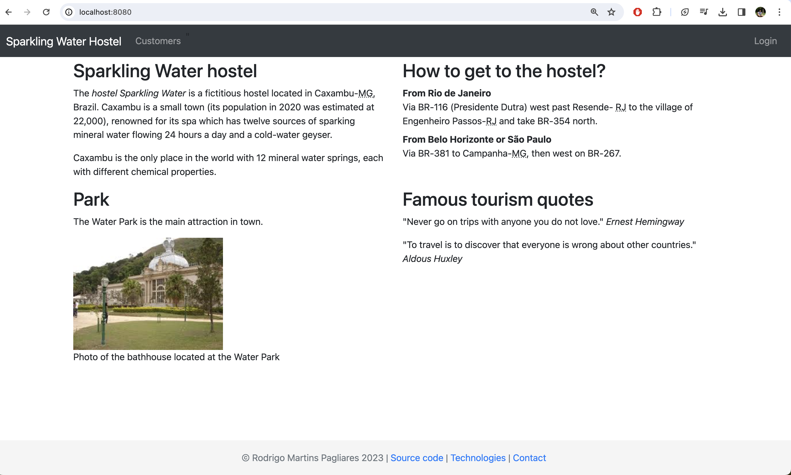

# HostelApp - a web application for the Hostel Sparkling Water

This repository contains the source-code and several other artifacts used in the course Application Lifecycle Manamegent - ALM - at the undeargraduate Computer Science course at UNIFAL - Alfenas - MG - Brazil.

 

<a href="Slides/How_to_Clone_and_Execute_the_HostelApp/How_to_Clone_and_Execute_the_HostelApp.pdf">How to download/clone HostelApp and run it within IntelliJ IDEA</a>

<a href="Slides/HostelApp_Web/Authentication_Authorization_HostelApp.pdf">Demonstration of the HostelApp</a>

There are two admin roles in the application. One role, played by a user called florentino with permission to create new guests and a second user named fermina that can only see the list of guests, but not create a new one.

## User and password with Admin role
**User**: florentino
**Password**: password

## User and password with Receptionist role
**User**: fermina
**Password**: foobar

<a href="https://www.youtube.com/embed/hs_UaWwU2-s?si=hMcxgw6srBRB9xl4" target="_blank">YouTube demonstration video</a>

